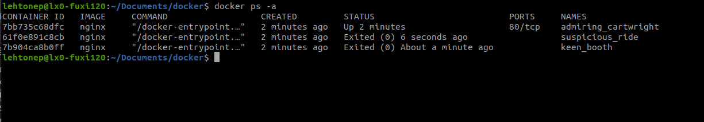
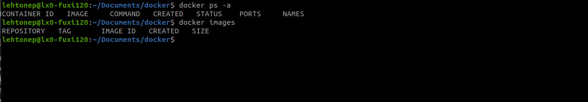

### exercises 1.1-1.2

output of exercise 1.1



output of exercise 1.2




### exercise 1.3

commands used:

`docker run -d -it --name exercise devopsdockeruh/simple-web-service:ubuntu`

`docker exec -it exercise bash`

output:

```
Secret message is: 'You can find the source code here: https://github.com/docker-hy'
2023-03-23 08:30:50 +0000 UTC
2023-03-23 08:30:52 +0000 UTC
2023-03-23 08:30:54 +0000 UTC
2023-03-23 08:30:56 +0000 UTC
2023-03-23 08:30:58 +0000 UTC
Secret message is: 'You can find the source code here: https://github.com/docker-hy'
```

### exercise 1.4

running the container:

`docker run -it --name exercise ubuntu sh -c 'while true; do echo "Input website:"; read website; echo "Searching..."; sleep 1; curl http://$website; done'`


```
Input website:
helsinki.fi
Searching...
sh: 1: curl: not found
Input website:
helsinki.fi
Searching...
<html>
<head><title>301 Moved Permanently</title></head>
<body>
<center><h1>301 Moved Permanently</h1></center>
<hr><center>nginx/1.20.1</center>
</body>
</html>
Input website:
```

After the first try from another terminal:

`docker exec -it exercise bash`

and installed curl with `apt-get`
